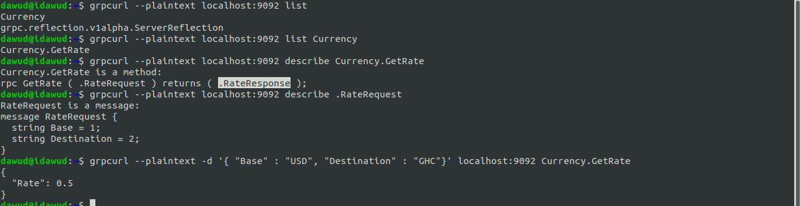

# Go gRPC Microservice

Setup:
* Install `proctc` to compile the `.proto` file. see [protoc-installation](https://grpc.io/docs/protoc-installation/)
* run `make protos` in the root dir
* To test the grpc server we install the `grpcurl`
```install grpcurl
    go get github.com/fullstorydev/grpcurl
    go install github.com/fullstorydev/grpcurl/cmd/grpcurl
    # to make sure it's installed properly
    grpcurl --help
```
see [grpcurl docmentation](https://github.com/fullstorydev/grpcurl)


* Because reflection has been enabled on the server, run 
`grpcurl --plaintext localhost:9092 list` to list out all services on the host.
Will echo  
``` echo display
    Currency
    grpc.reflection.v1alpha.ServerReflection
```
* `grpcurl --plaintext localhost:9092 list Currency`, where *Currency* is the service name
will display all the method on the server.
``` echo display
    Currency.GetRate
```
*GetRate* was the only method we declared in our .proto file and ultimately compiled it.

* `grpcurl --plaintext localhost:9092 describe Currency.GetRate` describes our method
  ```
  Currency.GetRate is a method:
  rpc GetRate ( .RateRequest ) returns ( .RateResponse ); 
  ```
* `grpcurl --plaintext localhost:9092 describe .RateRequest` describes our RateRequest message
  ```
  RateRequest is a message:
  message RateRequest {
    string Base = 1;
    string Destination = 2;
  }
  ```
* `grpcurl --plaintext -d '{ "Base" : "USD", "Destination" : "GHC"}' localhost:9092 Currency.GetRate`
  Like testing rest we pass a json of the RateRequest, which took a Base & Destination as string.
  We specify the server which is our localhost, and the service and method to execute, here the *Currency.GetRate*
  ```
  {
    "Rate": 0.5
  }
  ```
