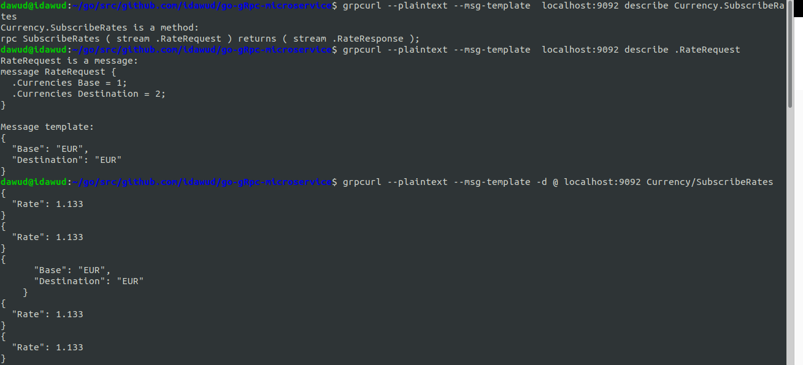

# Go gRPC Microservice

Setup:
* Install `proctc` to compile the `.proto` file. see [protoc-installation](https://grpc.io/docs/protoc-installation/)
* run `make protos` in the root dir
* To test the grpc server we install the `grpcurl`
```install grpcurl
    go get github.com/fullstorydev/grpcurl
    go install github.com/fullstorydev/grpcurl/cmd/grpcurl
    # to make sure it's installed properly
    grpcurl --help
```
see [grpcurl docmentation](https://github.com/fullstorydev/grpcurl)


* Because reflection has been enabled on the server, run 
`grpcurl --plaintext localhost:9092 list` to list out all services on the host.
Will echo  
``` echo display
    Currency
    grpc.reflection.v1alpha.ServerReflection
```
* `grpcurl --plaintext localhost:9092 list Currency`, where *Currency* is the service name
will display all the method on the server.
``` echo display
    Currency.GetRate
```
*GetRate* was the only method we declared in our .proto file and ultimately compiled it.

* `grpcurl --plaintext localhost:9092 describe Currency.GetRate` describes our method
  ```
  Currency.GetRate is a method:
  rpc GetRate ( .RateRequest ) returns ( .RateResponse ); 
  ```
* `grpcurl --plaintext localhost:9092 describe .RateRequest` describes our RateRequest message
  ```
  RateRequest is a message:
  message RateRequest {
    string Base = 1;
    string Destination = 2;
  }
  ```
* `grpcurl --plaintext -d '{ "Base" : "USD", "Destination" : "GHC"}' localhost:9092 Currency.GetRate`
  Like testing rest we pass a json of the RateRequest, which took a Base & Destination as string.
  We specify the server which is our localhost, and the service and method to execute, here the *Currency.GetRate*
  ```
  {
    "Rate": 0.5
  }
  ```
## Bi-Directional Streaming
To see the description of our bi-directional method SubscribeRates, run `grpcurl --plaintext --msg-template  localhost:9092 describe Currency.SubscribeRates`
this echo the method our .proto file
```
Currency.SubscribeRates is a method:
rpc SubscribeRates ( stream .RateRequest ) returns ( stream .RateResponse );
```

To test our client will have to pass a RateRequest, so let's describe it with a template
`grpcurl --plaintext --msg-template  localhost:9092 describe .RateRequest`
```
    RateRequest is a message:
    message RateRequest {
      .Currencies Base = 1;
      .Currencies Destination = 2;
    }
    
    Message template:
    {
      "Base": "EUR",
      "Destination": "EUR"
    }
```
Run the grpcurl client to subscribe to the stream coming from the server. The `-d @` arg means that 
our cli is open to receive input.
`grpcurl --plaintext --msg-template -d @ localhost:9092 Currency/SubscribeRates`

We will receive a rate object stream from the object every 5sec, we can copy and paste our RequestRate
message template to send a stream to our server. 
```
{
  "Rate": 1.133
}
{
  "Rate": 1.133
}
{
      "Base": "EUR",
      "Destination": "EUR"
    }
{
```


## Client Connection
After running the server, run the client in the client dir `go run client/currency_client.go` <br>
This will display
```
    2020-06-06T09:17:32.438Z [INFO]  Price at Rate: EXTRA_VALUE_AT_END=250
```
Since our static price is 500 and rate is 0.5, we get 250 displayed